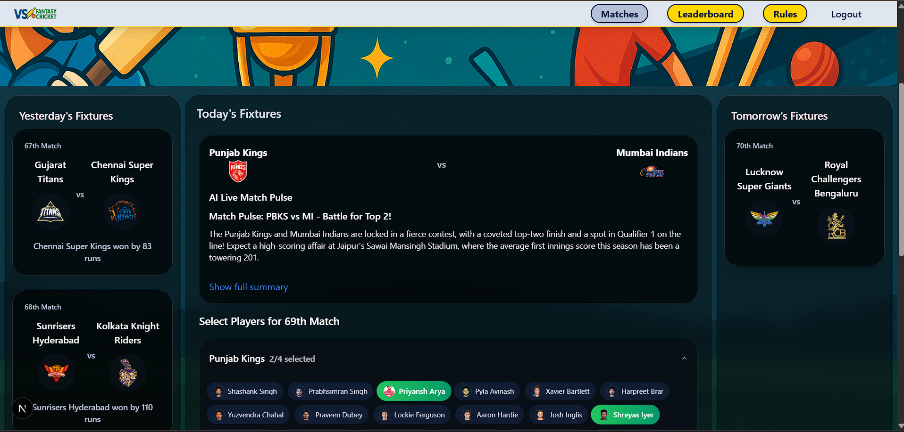

# Draft Day

**Draft Day** is a season-long salary-cap head-to-head fantasy cricket league — self-hosted for private competitions (2–12 teams, round-robin + playoffs, 12+4 squads, lock-to-lock transfers).

> Built on [sanaro99/fantasy-cricket](https://github.com/sanaro99/fantasy-cricket) (GPL-3.0). See [docs/UPSTREAM.md](./docs/UPSTREAM.md), [docs/ROADMAP.md](./docs/ROADMAP.md), and [docs/BRANCHING.md](./docs/BRANCHING.md).

## Quick links

| Doc | Description |
|-----|-------------|
| [ROADMAP](./docs/ROADMAP.md) | Feature phases and checklists |
| [BRANCHING](./docs/BRANCHING.md) | Git workflow and feature branches |
| [DEVELOPMENT](./docs/DEVELOPMENT.md) | Local setup and verify checklist |
| [VERCEL](./docs/VERCEL.md) | Deploy to Vercel for friends testing |
| [Agent skill](./.cursor/skills/cric-fantasy-league/SKILL.md) | Context for Cursor agents in new chats |

---

## Base app (upstream)

This project extends a Fantasy Cricket web app built with Next.js, Tailwind CSS, and Supabase. See upstream README below for original OAuth/leaderboard features.

## Technologies Used

- **Next.js** (React framework for SSR and SSG)
- **Tailwind CSS** (Utility-first CSS framework)
- **Supabase** (Backend-as-a-Service: authentication, database)
- **AOS** (Animate On Scroll library for UI animations)
